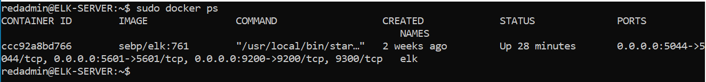

## Automated ELK Stack Deployment

This document contains the following details:
- Description of the Topology
- Access Policies
- ELK Configuration
- Target Machines & Beats
- How to Use the Ansible Build

### Description of the Topology

The main purpose of this network is to expose a load-balanced and monitored instance of DVWA, the D*mn Vulnerable Web Application.

Load balancing ensures that the application will be highly available, in addition to restricting inbound access to the network. The load balancer ensures that work to process incoming traffic will be shared by both vulnerable web servers. Access controls will ensure that only authorized users — namely, ourselves — will be able to connect in the first place. The additional use of a jump box provides a controlled means of access to manage our VMs in separate security zones.

Integrating an ELK server allows users to easily monitor the vulnerable VMs for changes to the file systems of the VMs on the network and system metrics, such as CPU usage; attempted SSH logins; sudo escalation failures; etc.
- **Filebeat** collects data about the file system.
- **Metricbeat** collects machine metrics, such as uptime.

The configuration details of each machine may be found below.

| Name     | Function   | IP Address | Operating System |
|----------|------------|------------|------------------|
| Jump Box | Gateway    | 10.0.0.4   | Linux            |
| DVWA 1   | Web Server | 10.0.0.5   | Linux            |
| DVWA 2   | Web Server | 10.0.0.6   | Linux            |
| DVWA 3   | Web Server | 10.0.0.7   | Linux            |
| ELK      | Monitoring | 10.1.0.4   | Linux            |

The files in this repository were used to configure the network depicted below.


These files have been tested and used to generate a live ELK deployment on Azure. They can be used to either recreate the entire deployment pictured above, or alternatively, select files may be used to install only certain pieces of it, such as Filebeat. The following is the Ansible playbook for installing ELK:

```yaml
---
  - name: Config elk VM with Docker
    hosts: elk
    remote_user: redadmin
    become: true
    tasks:

      - name: Use more memory
        sysctl:
          name: vm.max_map_count
          value: '262144'
          state: present
          reload: yes

      - name: docker.io
        apt:
          force_apt_get: yes
          update_cache: yes
          name: docker.io
          state: present

      - name: Install pip3
        apt:
          force_apt_get: yes
          name: python3-pip
          state: present

      - name: Install Python Docker module
        pip:
          name: docker
          state: present

        # Use docker_container module
      - name: download and launch a docker elk container
        docker_container:
          name: elk
          image: sebp/elk:761
          state: started
          restart_policy: always
          published_ports:
            - 5601:5601
            - 9200:9200
            - 5044:5044

        # Use systemd module
      - name: Enable service docker on boot
        systemd:
          name: docker
          enabled: yes
```

### Access Policies

The machines on the internal network are not exposed to the public Internet. 

Only the jump box machine can accept connections from the Internet. Access to this machine is only allowed from your local host public IP address after configuring the network security rules to allow SSH from your local host public IP.

Machines within the network can only be accessed by each other.
- The DVWA 1 and DVWA 2 VMs send traffic to the ELK server.

A summary of the access policies in place can be found in the table below.

| Name     | Publicly Accessible | Allowed IP Addressed |
|----------|---------------------|----------------------|
| Jump Box | Yes                 | your local host IP   |
| DVWA 1   | No                  | 10.0.0.1-254         |
| DVWA 2   | No                  | 10.0.0.1-254         |
| DVWA 3   | No                  | 10.0.0.1-254         |
| ELK      | No                  | 10.0.0.1-254         |

### Elk Configuration

Ansible was used to automate configuration of the ELK machine. No configuration was performed manually, which is advantageous because human errors and inconsistencies with manual configuration are removed when configuration is defined as code. Additionally, the labor cost with manual configuration is removed via automation.

The playbook implements the following tasks:
- Install docker.io
- Install pip3
- Install Docker python module
- Use more memory
- Download and launch a docker elk container
- Enable service docker on boot

The following screenshot displays the result of running `docker ps` after successfully configuring the ELK instance.


### Target Machines & Beats
This ELK server is configured to monitor the following machines:
- DVWA Web-1, DVWA Web-2 VMs, and DVWA Web-3 at 10.0.0.5, 10.0.0.6, and 10.0.0.7 respectively.

The following Beats are installed on these machines:
- Filebeat
- Metricbeat

These Beats allow us to collect the following information from each machine:
- **Filebeat**: Filebeat detects changes to the filesystem. Specifically, we use it to collect Apache logs.
- **Metricbeat**: Metricbeat detects changes in system metrics, such as CPU usage. We use it to detect SSH login attempts, failed `sudo` escalations, and CPU/RAM statistics.

The playbook below installs Metricbeat on the target hosts. The playbook for installing Filebeat is included, and looks essentially identical — simply replace `metricbeat` with `filebeat`, and it will work as expected.

```yaml
---
- name: Install metric beat
  hosts: webservers
  become: true
  tasks:
    # Use command module
  - name: Download metricbeat
    command: curl -L -O https://artifacts.elastic.co/downloads/beats/metricbeat/metricbeat-7.4.0-amd64.deb

    # Use command module
  - name: install metricbeat
    command: dpkg -i metricbeat-7.4.0-amd64.deb

    # Use copy module
  - name: drop in metricbeat config
    copy:
      src: /etc/ansible/files/metricbeat-config.yml
      dest: /etc/metricbeat/metricbeat.yml

    # Use command module
  - name: enable and configure docker module for metric beat
    command: metricbeat modules enable docker

    # Use command module
  - name: setup metric beat
    command: metricbeat setup

    # Use command module
  - name: start metric beat
    command: service metricbeat start

    # Use systemd module
  - name: Enable service metricbeat on boot
    systemd:
      name: metricbeat
      enabled: yes
```

### How to Use the Ansible Build
In order to use the playbooks, you will need to have an Ansible control node already configured. We use the **jump box** for this purpose.

To use the playbooks, we must perform the following steps:
- Copy the playbooks to the Ansible Control Node
- Run each playbook on the appropriate targets

The easiest way to copy the playbooks is to use Git:

```bash
$ cd /etc/ansible
$ mkdir files
# Clone Repository + IaC Files
$ git clone https://github.com/changtb/ELK-Project.git
# Move Playbooks and hosts file Into `/etc/ansible`
$ cp ELK-Project/Ansible/* .
$ cp project-1/files/* ./files
```

This copies the playbook files to the correct place.

Next, you must create a `hosts` file to specify which VMs to run each playbook on. Run the commands below:

```bash
$ cd /etc/ansible
$ cat > hosts <<EOF
[webservers]
10.0.0.5 ansible_python_interpreter=/usr/bin/python3
10.0.0.6 ansible_python_interpreter=/usr/bin/python3
10.0.0.7 ansible_python_interpreter=/usr/bin/python3

[elk]
10.1.0.4 ansible_python_interpreter=/usr/bin/python3
EOF
```

After this, the commands below run the playbook:

 ```bash
 $ cd /etc/ansible
 $ ansible-playbook install_elk.yml
 $ ansible-playbook install_filebeat.yml
 $ ansible-playbook install_metricbeat.yml
 ```

To verify success, wait five minutes to give ELK time to start up. 

Then, run: `curl http://10.1.0.4:5601/app/kibana`. This is the address of Kibana. If the installation succeeded, this command should print HTML to the console.# ELK-Project
